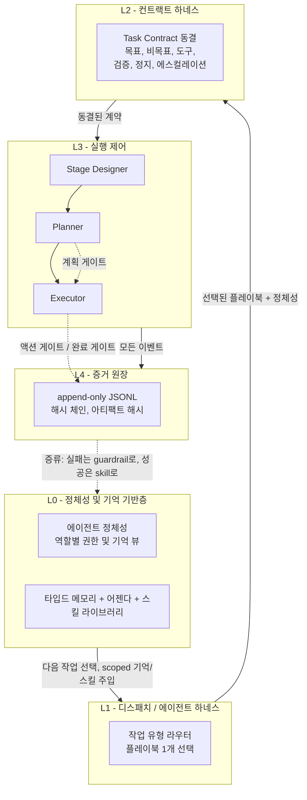
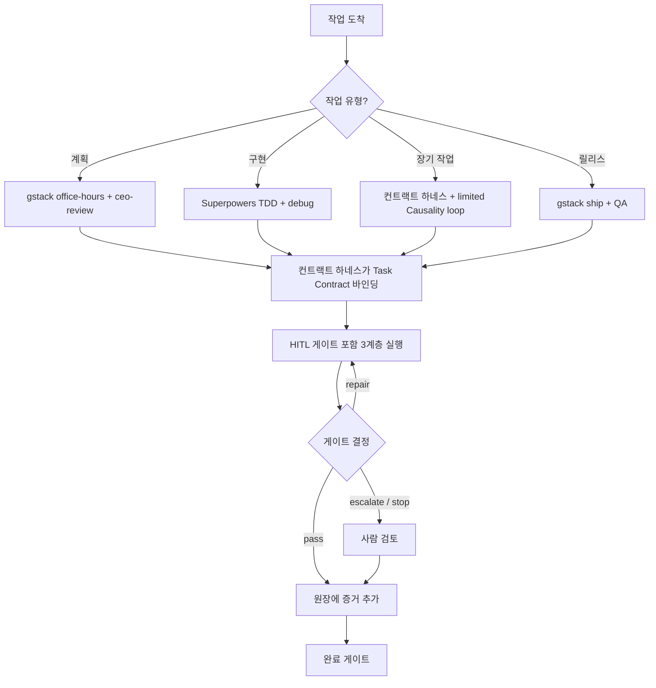
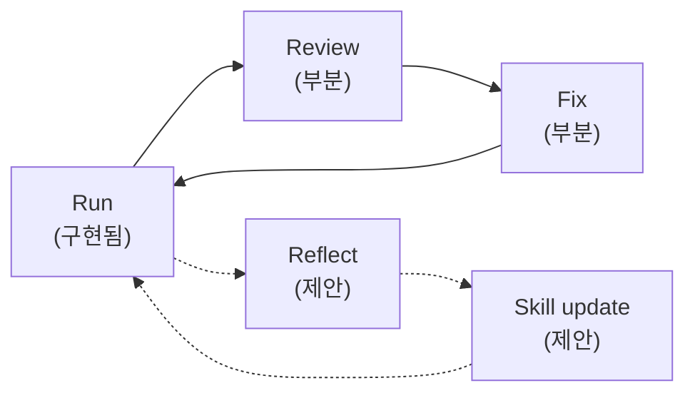
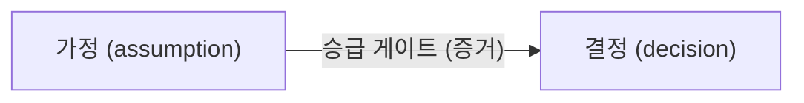

[English](README.md) | **한국어**

# Causality

Causality은 Claude, Codex, 그리고 에이전트 기반 프로젝트를 위한 로컬 우선·의존성
경량 에이전트 워크플로 키트입니다. 세 갈래의 설계를 하나의 휴먼-인-더-루프(HITL)
제어면으로 결합합니다.

- **Ouroboros** — 목표 계약(goal contract), append-only 증거 원장(ledger), 상태
  전이, 플러그인 계약, HITL 게이트.
- **Superpowers** — 계획 수립, 테스트 주도 개발(TDD), 근본원인 디버깅, 완료 전
  검증, 슬래시 커맨드 사용성.
- **gstack** — 브라우저 규율: 압축 접근성(A11y) 스냅샷, 안정적 ref, 액션 diff,
  증거 우선 QA.

이 구현은 독립형입니다. 상위(upstream) 프로젝트 소스를 벤더링하지 않으며, 상위
프로젝트는 MIT 라이선스이고 [THIRD_PARTY_NOTICES.md](THIRD_PARTY_NOTICES.md)에
명시되어 있습니다. **Python >= 3.11** 을 대상으로 하고 **표준 라이브러리만**
사용합니다(런타임 의존성 없음).

---

## 아키텍처

설계 코퍼스([docs/adr/](docs/adr/) 참조)는 **5계층 혼합 아키텍처**
([ADR 0006](docs/adr/0006-final-blended-architecture.md))로 수렴합니다. 각 계층은
단일 책임을 가지며 인접 계층과만 통신합니다. 위에서 아래로는 **제어 흐름**,
아래에서 위로는 **진화(증류) 환류 루프**입니다.



**게이트 배치(L3):** `Planner` 출력은 **계획 게이트**(`evaluate_plan`)가, 부작용을
일으키는 각 단계는 **액션 게이트**(`can_execute_action`)가, "완료" 주장은 **완료
게이트**(`complete`)가 검사합니다. 고위험·비가역 작업은 사람에게 에스컬레이션됩니다.

> 제어 흐름(L0→L4)과 루프의 앞 절반은 현재 구현되어 있습니다. 아래에서 위로 가는
> **증류** 루프(L4→L0)는 목표 구조이며 대부분 아직 미구현입니다 —
> [자기개선 루프](#자기개선-루프)와 [구현 상태](#구현-상태-adrs) 참조.

---

## 운영 규칙 워크플로

작업이 도착하면 에이전트 하네스(L1)가 작업 유형에 따라 **단 하나**의 플레이북을
선택하고, 컨트랙트 하네스(L2)가 Task Contract를 동결하며, 실행은 HITL 게이트가
있는 3계층 제어 스택(L3)을 통과하고, 모든 이벤트가 원장(L4)에 추가됩니다.



### Context Economy(컨텍스트 경제)

**상시 로드(always-loaded)** 컨텍스트를 최소화합니다
([ADR 0007](docs/adr/0007-context-economy-progressive-disclosure.md)). 긴 워크플로,
체크리스트, 역할 설명, 템플릿은 파일로 저장하고 **필요할 때만** 읽습니다.

- **상시 로드는 다음만:** 얇은 규칙+라우팅 파일, 활성 Task Contract, 원장 tail.
- 작업 유형 확정 후: `workflow/<type>.md` 하나만 읽습니다.
- 매칭될 때만 스킬 로드: `skills/<name>.md`(authored가 earned보다 우선).
- 검증 시점: `checklists/<type>.md` 하나만 읽습니다.
- 현재 작업에 scoped된 기억만 조회 — 전체 `memory/` 는 절대 로드하지 않습니다.
- 완료 시: `memory/<type>/` 에 타입이 지정된 요약만 추가합니다.

---

## 자기개선 루프

의도된 루프는 두 절반으로 구성됩니다: **Run → Review → Fix**, 그리고
**Reflect → Skill update**([ADR 0006 §6](docs/adr/0006-final-blended-architecture.md)).
앞 절반은 기존 프리미티브의 조합으로 달성 가능하지만, 뒤 절반은 아직 존재하지 않는
신규 컴포넌트에 의존합니다.



| 단계 | 상태 | 비고 |
|---|---|---|
| Run | 구현됨 | `record_evidence` / `record_verifier` 가 원장에 추가. |
| Review | 부분 | `HITLGate.complete` 가 verifier 통과·증거를 판정하나, 자동 verifier 호출자는 미제공. |
| Fix | 부분 | `GateDecision.REPAIR` 가 재계획 신호이나, 이를 소비하는 런타임 루프 없음. |
| Reflect | 제안 | 회고 추출기·trajectory 캡처 없음. |
| Skill update | 제안 | 스킬 스토어·증류기·재현성 검사·승급 게이트 없음. |

---

## Task Contract

`TaskContract`는 `GoalContract`의 **불변·파생 뷰**이며, 새로운 목표 명세가 아닙니다
([ADR 0001](docs/adr/0001-task-contract-as-binding-rules.md)). `frozen`이고 컨트랙트
하네스가 한 번만 생성합니다. 유일하게 새로 추가된 데이터 필드는 `non_goals`로,
구속 의무(Geas)를 넓히는 것이 아니라 범위를 **좁히는**(hard boundary) 장치입니다.

6개 조항:

| 조항 | 출처 | 의미 |
|---|---|---|
| **Objective(목표)** | `title` + `summary` | 단일 목표. 확장 금지. |
| **Non-goals(비목표)** | `non_goals` | 명시적 범위 차단; 매칭 시 액션을 STOP. |
| **Allowed tools(허용 도구)** | `permissions.allowed_tools` | 선언된 도구 목록; 벗어나면 ESCALATE. |
| **Verification(검증)** | 필수 `evidence_required` | 작업을 증명해야 할 증거. |
| **Stop condition(정지 조건)** | `stopping_policy` | 언제 멈출지: 반복 횟수, 무진전, 실패 가설. |
| **Escalation(에스컬레이션)** | 게이트 동작의 파생 뷰 | 고위험·비가역 트리거를 사람에게 라우팅. |

컨트랙트 하네스(`ContractHarness.bind`)는 5단계 실행 직전 의식(목표·비목표·허용
도구·검증·정지 조건)을 수행하고, 계약을 정확히 한 번 단일 `GOAL_CONTRACT` 원장
이벤트로 기록한 뒤, 동결된 `TaskContract`를 반환합니다.

---

## 메모리 거버넌스

장기 기억은 **6개의 타입드 스토어**로 분리됩니다
([ADR 0005](docs/adr/0005-identity-memory-skill-substrate.md)).

| 스토어 | 보관 내용 |
|---|---|
| `decisions` | 확정된 결정(승급 게이트 통과 후에만 진입). |
| `assumptions` | 잠정 가정, TTL 적용; 계획 전제가 아님. |
| `failures` | 실패 사례; 만료되는 guardrail 후보(래칫 없음). |
| `playbooks` | 재사용 절차; earned-skill 후보. |
| `snippets` | 코드/커맨드 조각, 각각 출처 ref 동반. |
| `retrospectives` | 회고; 가정과 결정을 명시적으로 구분 표기. |

`assumptions`는 `decisions`와 **분리**해 메모리 오염을 방지합니다. 검증되지 않은
추측이 확정 지식으로 둔갑해서는 안 됩니다. 가정은 확정 증거를 갖춘 **승급
게이트**를 통해서만 결정으로 승격됩니다.



---

## 구현 상태 (ADRs)

[docs/adr/README.md](docs/adr/README.md)에서 가져왔습니다.

| ADR | 제목 | 상태 |
|---|---|---|
| [0001](docs/adr/0001-task-contract-as-binding-rules.md) | Task Contract — 구속 규칙 계층 | **Accepted / 구현** |
| [0002](docs/adr/0002-three-layer-control-stack.md) | 3계층 실행 제어 스택 | **Accepted / 부분** |
| [0003](docs/adr/0003-contract-harness.md) | Contract Harness | **Accepted / 구현** |
| [0004](docs/adr/0004-agent-harness-task-routing.md) | Agent Harness 작업 라우팅 | **Accepted / 구현** |
| [0005](docs/adr/0005-identity-memory-skill-substrate.md) | 정체성·기억·스킬 기반층 | **Accepted / 부분** |
| [0006](docs/adr/0006-final-blended-architecture.md) | 최종 혼합(5계층) 아키텍처 | **Accepted / 부분** |
| [0007](docs/adr/0007-context-economy-progressive-disclosure.md) | Context Economy / 점진적 공개 | **Accepted / 부분** |
| [0008](docs/adr/0008-repository-hygiene-shared-vs-ignored.md) | 저장소 위생: 공유 vs 무시 | **Accepted / 구현** |

현재 구현됨: `non_goals` 필드와 동결된 `TaskContract`; 집행 게이트
(`check_tool_allowed` / `check_non_goal` / `should_stop`); `BoundContract`를
반환하는 `ContractHarness.bind`; bounded 루프 드라이버(`run_bounded_loop`);
거버넌스 포함 타입 메모리(`TypedMemory`); Agent Harness 디스패처(`AgentHarness`);
Reflect 증류기(`reflect_on_contract`); 3계층 워크플로 메타데이터
(`WorkflowTemplate.layer`); on-demand 파일 레이아웃(`workflow/` `checklists/`
`skills/` `memory/<6타입>/`)과 Context Economy 운영 규칙; 공유 vs 무시 위생 규칙.
미구현: 완전한 Review 자동화, earned-skill distiller·재현성·승급(진화 루프 뒤 절반),
Agenda 영속화, 디스패처→하니스→루프 end-to-end 런타임.

---

## 새 프로젝트에 설치되는 것

패키지를 설치한 뒤 대상 프로젝트에서 인스톨러를 한 번 실행합니다.

```bash
pip install -e .
causality install-agent
```

다음을 생성합니다.

```text
AGENTS.md                                  # Codex 실행 진입점
CLAUDE.md                                  # Claude 지침
.codex/causality-routing.md                # Codex 라우팅 컨텍스트
.claude/commands/causality-plan.md
.claude/commands/causality-verify.md
.claude/commands/causality-root-cause.md
.claude/commands/causality-a11y-observe.md
.claude/commands/causality-complete.md
.causality/agent-rules.md                  # 얇은 규칙 + 라우팅
.causality/causality-workflows.json        # 워크플로 manifest
.causality/mcp.json                        # MCP 서버 설정
.causality/ledger.jsonl                    # append-only 증거 원장
workflow/README.md + workflow/<type>.md    # workflows.py의 생성 뷰
checklists/README.md + verification-before-completion.md
skills/README.md                           # authored + earned 스킬
memory/README.md
memory/{decisions,assumptions,failures,playbooks,snippets,retrospectives}/README.md
```

기존 파일은 기본적으로 건너뜁니다. 기존 프로젝트 지침을 교체할 의도가 있을 때만
`--force`를 사용하세요.

---

## CLI 사용법

```bash
causality init            # 원장과 워크플로 manifest 생성
causality manifest        # 워크플로 manifest 출력 (--pretty 추가)
causality context         # 원장 tail + 워크플로 이름 출력 (--pretty, --limit N)
causality install-agent   # 프로젝트 수준 에이전트 자동화 설치 (--project, --force)
```

### Claude 및 Codex 사용법

Claude는 설치된 프로젝트 슬래시 커맨드를 사용할 수 있습니다.

```text
/causality-plan
/causality-verify
/causality-root-cause
/causality-a11y-observe
/causality-complete
```

Codex는 `AGENTS.md`, `.codex/causality-routing.md`, `.causality/agent-rules.md`를
자동 라우팅 컨텍스트로 사용합니다.

- 계획 / 스펙 요청 -> `causality-plan`
- 구현 또는 검증 요청 -> `causality-verify`
- 버그 / 회귀 요청 -> `causality-root-cause`
- 브라우저 / UI 흐름 요청 -> `causality-a11y-observe`
- "완료" / "배포" / 최종 핸드오프 -> `causality-complete`

---

## MCP 스타일 도구 서버

프로젝트 MCP 설정을 지원하는 클라이언트라면 stdio 서버를 등록합니다.

```bash
python -m causality.mcp_server --project .
```

생성된 `.causality/mcp.json`에 동일한 커맨드가 들어 있습니다. 노출 도구:

- `causality_init` — 프로젝트 수준 에이전트 자동화 파일 설치
- `causality_context` — 원장 tail과 워크플로 이름 반환
- `causality_append_evidence` — `.causality/ledger.jsonl`에 증거 추가
- `causality_workflows` — 워크플로 manifest 반환

---

## 브라우저 / A11y 설정

브라우저 어댑터는 드라이버 비종속적입니다. 스냅샷/액션 스타일 커맨드를 지원하는
임의의 CLI를 환경 변수로 지정하세요.

```bash
export CAUSALITY_BROWSER_BIN="/path/to/browser-driver"
```

페이지 텍스트와 스냅샷은 **신뢰할 수 없는 외부 콘텐츠**로 취급하며 지시 소스로
사용해서는 안 됩니다. 관측은 압축 A11y 스냅샷, 안정적 ref, 상태 diff를 사용해
브라우저 상태를 프롬프트 밖에 둡니다.

하위 프로젝트에서 Playwright 접근성 검사를 위해:

```bash
npm install -D @playwright/test @axe-core/playwright
npx playwright install
```

선택적 CI 도구:

```bash
npm install -D pa11y lighthouse
```

---

## 개발 및 테스트

```bash
python -m venv .venv
source .venv/bin/activate
pip install -e .
```

테스트 실행(표준 라이브러리 `unittest`, 추가 의존성 없음):

```bash
PYTHONPATH=src python -m unittest discover -s tests
```

현재 프로젝트 컨텍스트 확인:

```bash
causality context --pretty
```

**CI:** GitHub Actions가 Python **3.11 / 3.12 / 3.13** 매트릭스를 실행합니다 —
`src`와 `tests`를 바이트 컴파일하고, 단위 테스트를 돌리고, editable install
스모크 테스트를 수행합니다([.github/workflows/ci.yml](.github/workflows/ci.yml)
참조).

---

## 핵심 런타임 개념

```text
GoalContract -> Plan -> HITL 계획 게이트 -> Execute (액션 게이트) -> EvidenceLedger
             -> Verifier 풀 -> 완료 게이트 -> Repair / Escalate / Stop / Complete
```

주요 모듈(`src/causality/` 하위):

- `contracts.py` — `GoalContract`, `TaskContract`, 위험 등급, 권한, 증거 요건,
  `non_goals`, 게이트 결정 / 이벤트 enum.
- `contract_harness.py` — `ContractHarness.bind`, 실행 직전 바인딩 의식.
- `gates.py` — `HITLGate`: `evaluate_plan` / `can_execute_action` / `complete`
  및 집행 메서드 `check_tool_allowed` / `check_non_goal` / `should_stop`.
- `orchestrator.py` — 원장과 게이트를 감싸는 `Causality` 퍼사드.
- `ledger.py` — 해시 체인과 아티팩트 해싱을 갖춘 append-only JSONL 원장.
- `workflows.py` — 워크플로 템플릿과 manifest(단일 출처).
- `browser_adapter.py` — 범용 A11y 스냅샷 / ref-액션 / diff 어댑터.
- `agent_bootstrap.py` — Claude/Codex 프로젝트 자동화 인스톨러.
- `mcp_server.py` — 최소 로컬 stdio 도구 서버.

---

## 설계 결정 (ADRs)

아키텍처 결정은 [docs/adr/](docs/adr/) 하위에 기록되며, 각 ADR은 동기(Context)·
결정(Decision)·대안(Alternatives)·영향(Consequences) 순으로 작성하고 근거 코드를
`file:line`으로 인용합니다. 구속 envelope는
[0001](docs/adr/0001-task-contract-as-binding-rules.md)과
[0003](docs/adr/0003-contract-harness.md)부터, 전체 5계층 그림은
[0006](docs/adr/0006-final-blended-architecture.md), 운영 규칙은
[0007](docs/adr/0007-context-economy-progressive-disclosure.md)에서 보세요.

---

## 저장소 구성

```text
docs/
  agent_automation.md
  installation.md
  causality_integration.md
  adr/
    README.md
    0001-task-contract-as-binding-rules.md
    0002-three-layer-control-stack.md
    0003-contract-harness.md
    0004-agent-harness-task-routing.md
    0005-identity-memory-skill-substrate.md
    0006-final-blended-architecture.md
    0007-context-economy-progressive-disclosure.md
examples/
  goal_contract.json
plugins/
  causality-workflows/manifest.json
src/causality/
  agent_bootstrap.py
  browser_adapter.py
  cli.py
  contract_harness.py
  contracts.py
  gates.py
  ledger.py
  mcp_server.py
  orchestrator.py
  workflows.py
tests/
  test_agent_bootstrap.py
  test_browser_adapter.py
  test_contract_harness.py
  test_contracts.py
  test_gates.py
  test_ledger.py
  test_mcp_server.py
  test_workflows.py
.github/workflows/ci.yml
LICENSE
THIRD_PARTY_NOTICES.md
pyproject.toml
```

---

## 라이선스 및 출처 표기

이 저장소는 [MIT LICENSE](LICENSE) 하의 원본 구현이며, 상위 소스를 벤더링하지
않습니다. 참조한 프로젝트(Ouroboros, Ouroboros Plugins, Superpowers, gstack)는
MIT 라이선스이고 [THIRD_PARTY_NOTICES.md](THIRD_PARTY_NOTICES.md)에 명시되어
있습니다. 비공개·공개 사본 어디서든 `LICENSE`와 `THIRD_PARTY_NOTICES.md`를
유지하세요. 추후 상당량의 상위 소스를 복사해 넣는다면 해당 상위 저작권 고지도
추가하세요. 이것은 엔지니어링 라이선스 노트이며 법률 자문이 아닙니다.
