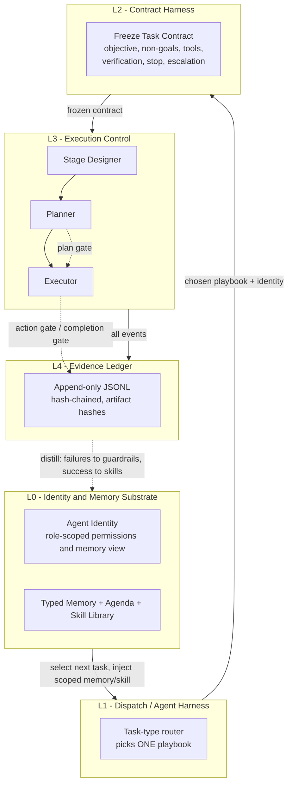
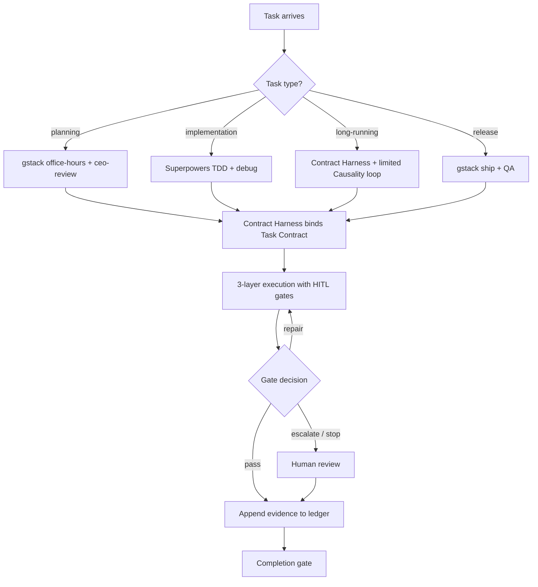
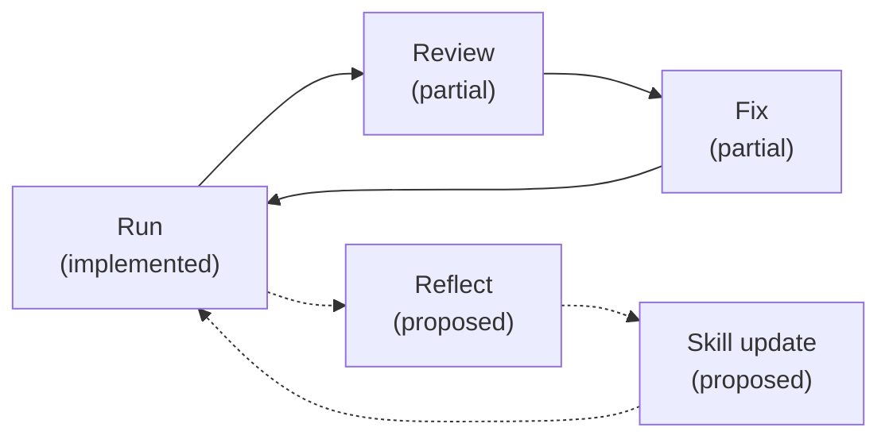
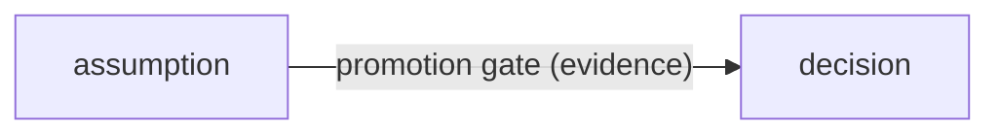

**English** | [한국어](README.ko.md)

# Causality

Causality is a local-first, dependency-light agent workflow kit for Claude,
Codex, and agent-driven projects. It blends three lineages into one
human-in-the-loop control surface:

- **Ouroboros** — goal contracts, an append-only evidence ledger, state
  transitions, plugin contracts, and HITL gates.
- **Superpowers** — planning, test-driven development, root-cause debugging,
  verification-before-completion, and slash-command ergonomics.
- **gstack** — browser discipline: compact accessibility (A11y) snapshots,
  stable refs, action diffs, and evidence-first QA.

The implementation is standalone. It does not vendor upstream project source;
the upstream projects are MIT-licensed and credited in
[THIRD_PARTY_NOTICES.md](THIRD_PARTY_NOTICES.md). It targets **Python >= 3.11**
and uses the **standard library only** (no runtime dependencies).

---

## Architecture

The design corpus (see [docs/adr/](docs/adr/)) converges on a **five-layer
blended architecture** ([ADR 0006](docs/adr/0006-final-blended-architecture.md)).
Each layer has a single responsibility and talks only to its neighbours. Top to
bottom is the **control flow**; bottom to top is the **evolution (distill)
feedback loop**.



**Gate placement (L3):** the `Planner` output is checked by the **plan gate**
(`evaluate_plan`); each side-effecting step is checked by the **action gate**
(`can_execute_action`); and a claim of "done" is checked by the **completion
gate** (`complete`). High-risk and irreversible work escalates to a human.

> The control flow (L0 to L4) and the front half of the loop are implemented
> today. The bottom-up **distill** loop (L4 to L0) is a target structure and is
> largely not yet implemented — see [Self-improvement loop](#self-improvement-loop)
> and [Status](#status-adrs).

---

## Operating-rule workflow

When a task arrives, the Agent Harness (L1) selects exactly **one** playbook by
task type, the Contract Harness (L2) freezes a Task Contract, execution runs
through the three-layer control stack with HITL gates (L3), and every event is
appended to the ledger (L4).



### Context Economy

Keep **always-loaded** context minimal
([ADR 0007](docs/adr/0007-context-economy-progressive-disclosure.md)). Long
workflows, checklists, role descriptions, and templates are stored as files and
read **on demand**:

- **Always load only:** the thin rules + routing file, the active Task Contract,
  and the ledger tail.
- After the task type is fixed: read only `workflow/<type>.md`.
- Load a skill only when matched: `skills/<name>.md` (authored takes precedence
  over earned).
- At verification: read only `checklists/<type>.md`.
- Retrieve only scoped memory for the current task — never the whole `memory/`.
- On completion: append only a typed summary to `memory/<type>/`.

---

## Self-improvement loop

The intended loop has two halves: **Run to Review to Fix**, and **Reflect to
Skill update** ([ADR 0006 §6](docs/adr/0006-final-blended-architecture.md)). The
front half is achievable by composing existing primitives; the back half
depends on new components that do not exist yet.



| Step | Status | Notes |
|---|---|---|
| Run | Implemented | `record_evidence` / `record_verifier` append to the ledger. |
| Review | Partial | `HITLGate.complete` judges verifier passes and evidence, but an automated verifier caller is not provided. |
| Fix | Partial | `GateDecision.REPAIR` signals replan, but no runtime loop consumes it. |
| Reflect | Proposed | No retrospective extractor or trajectory capture exists. |
| Skill update | Proposed | No skill store, distiller, reproducibility check, or promotion gate. |

---

## Task Contract

A `TaskContract` is an **immutable, derived view** of a `GoalContract` — not a
new goal specification ([ADR 0001](docs/adr/0001-task-contract-as-binding-rules.md)).
It is `frozen` and produced once by the Contract Harness. The single net-new
data field is `non_goals`, which **narrows** scope (a hard boundary) rather than
widening the binding obligation.

The six clauses:

| Clause | Source | Meaning |
|---|---|---|
| **Objective** | `title` + `summary` | The single goal. No expansion. |
| **Non-goals** | `non_goals` | Explicit out-of-scope boundary; a match stops the action. |
| **Allowed tools** | `permissions.allowed_tools` | A declared tool list; a tool outside it escalates. |
| **Verification** | required `evidence_required` | Evidence that must prove the work. |
| **Stop condition** | `stopping_policy` | When to stop: iterations, no-progress, failed hypotheses. |
| **Escalation** | derived view of gate behaviour | High-risk / irreversible triggers that route to a human. |

The Contract Harness (`ContractHarness.bind`) runs a five-step pre-run ritual
(objective, non-goals, allowed tools, verification, stop condition), records the
contract exactly once as a single `GOAL_CONTRACT` ledger event, and returns the
frozen `TaskContract`.

---

## Memory governance

Long-term memory is split into **six typed stores**
([ADR 0005](docs/adr/0005-identity-memory-skill-substrate.md)):

| Store | Holds |
|---|---|
| `decisions` | Confirmed decisions (only after the promotion gate). |
| `assumptions` | Tentative assumptions, subject to TTL; not planning premises. |
| `failures` | Failure cases; guardrail candidates that expire (no ratchet). |
| `playbooks` | Reusable procedures; earned-skill candidates. |
| `snippets` | Code/command snippets, each with a source ref. |
| `retrospectives` | Retrospectives; label assumptions vs decisions explicitly. |

`assumptions` are kept **separate** from `decisions` to prevent memory
pollution: an unverified guess must never masquerade as confirmed knowledge.
An assumption only becomes a decision through a **promotion gate** backed by
confirming evidence.



---

## Status (ADRs)

Pulled from [docs/adr/README.md](docs/adr/README.md).

| ADR | Title | Status |
|---|---|---|
| [0001](docs/adr/0001-task-contract-as-binding-rules.md) | Task Contract as binding rules | **Accepted / Implemented** |
| [0002](docs/adr/0002-three-layer-control-stack.md) | Three-layer control stack | **Accepted / Partial** |
| [0003](docs/adr/0003-contract-harness.md) | Contract Harness | **Accepted / Implemented** |
| [0004](docs/adr/0004-agent-harness-task-routing.md) | Agent Harness task routing | **Accepted / Implemented** |
| [0005](docs/adr/0005-identity-memory-skill-substrate.md) | Identity / memory / skill substrate | **Accepted / Implemented** |
| [0006](docs/adr/0006-final-blended-architecture.md) | Final blended (5-layer) architecture | **Accepted / Implemented** |
| [0007](docs/adr/0007-context-economy-progressive-disclosure.md) | Context Economy / progressive disclosure | **Accepted / Partial** |
| [0008](docs/adr/0008-repository-hygiene-shared-vs-ignored.md) | Repository hygiene: shared vs ignored | **Accepted / Implemented** |

The self-improvement loop is now closed end to end. Implemented: the `non_goals`
field and frozen `TaskContract`; the enforcing gates (`check_tool_allowed` /
`check_non_goal` / `should_stop`); `ContractHarness.bind` returning a
`BoundContract`; the bounded loop driver (`run_bounded_loop`); automated Review
(`run_review`); typed memory with governance (`TypedMemory`); the Reflect
distiller (`reflect_on_contract`); the earned-skill store with n-of-m
reproducibility, dedup, and HITL promotion (`SkillStore`); the persisted
`Agenda`; the Agent Harness dispatcher (`AgentHarness`); three-layer workflow
metadata (`WorkflowTemplate.layer`); the on-demand file layout (`workflow/`
`checklists/` `skills/` `memory/<6 types>/`) with the Context Economy rule; the
share-vs-ignore hygiene rules; and the **`CausalityEngine`** that wires
Agenda → Dispatch → Harness → Loop → Review → Reflect → Skill into one
`run_task` / `run_next`. Remaining (optional): a standard tool-execution adapter
for the `work` callback, automatic reuse of earned skills at dispatch, a
guardrail-TTL expiry sweep, and multi-agent collaboration (intentionally out of
scope, ADR 0005).

---

## What gets installed into a new project

Install the package, then run the installer once in a target project:

```bash
pip install -e .
causality install-agent
```

It writes:

```text
AGENTS.md                                  # Codex execution entry point
CLAUDE.md                                  # Claude instructions
.codex/causality-routing.md                # Codex routing context
.claude/commands/causality-plan.md
.claude/commands/causality-verify.md
.claude/commands/causality-root-cause.md
.claude/commands/causality-a11y-observe.md
.claude/commands/causality-complete.md
.causality/agent-rules.md                  # thin rules + routing
.causality/causality-workflows.json        # workflow manifest
.causality/mcp.json                        # MCP server config
.causality/ledger.jsonl                    # append-only evidence ledger
workflow/README.md + workflow/<type>.md    # generated views of workflows.py
checklists/README.md + verification-before-completion.md
skills/README.md                           # authored + earned skills
memory/README.md
memory/{decisions,assumptions,failures,playbooks,snippets,retrospectives}/README.md
```

Existing files are skipped by default. Use `--force` only when you intend to
replace existing project instructions.

---

## CLI usage

```bash
causality init            # create a ledger and workflow manifest
causality manifest        # print the workflow manifest (add --pretty)
causality context         # print ledger tail + workflow names (--pretty, --limit N)
causality install-agent   # install project-level agent automation (--project, --force)
```

### Claude and Codex usage

Claude can use the installed project slash commands:

```text
/causality-plan
/causality-verify
/causality-root-cause
/causality-a11y-observe
/causality-complete
```

Codex uses `AGENTS.md`, `.codex/causality-routing.md`, and
`.causality/agent-rules.md` as automatic routing context:

- planning / spec request -> `causality-plan`
- implementation or verification request -> `causality-verify`
- bug / regression request -> `causality-root-cause`
- browser / UI flow request -> `causality-a11y-observe`
- "done" / "ship" / final handoff -> `causality-complete`

---

## MCP-style tool server

For clients that support project MCP configuration, register the stdio server:

```bash
python -m causality.mcp_server --project .
```

The generated `.causality/mcp.json` contains the same command. Exposed tools:

- `causality_init` — install project-level agent automation files
- `causality_context` — return ledger tail and workflow names
- `causality_append_evidence` — append evidence to `.causality/ledger.jsonl`
- `causality_workflows` — return the workflow manifest

---

## Browser / A11y setup

The browser adapter is driver-agnostic. Point it at any CLI that supports
snapshot/action-style commands via an environment variable:

```bash
export CAUSALITY_BROWSER_BIN="/path/to/browser-driver"
```

Page text and snapshots are treated as **untrusted external content** and must
not be used as an instruction source. Observations use compact A11y snapshots,
stable refs, and state diffs to keep browser state out of the prompt.

For Playwright accessibility checks in downstream projects:

```bash
npm install -D @playwright/test @axe-core/playwright
npx playwright install
```

Optional CI tools:

```bash
npm install -D pa11y lighthouse
```

---

## Development and testing

```bash
python -m venv .venv
source .venv/bin/activate
pip install -e .
```

Run the tests (standard library `unittest`, no extra dependencies):

```bash
PYTHONPATH=src python -m unittest discover -s tests
```

Inspect the current project context:

```bash
causality context --pretty
```

**CI:** GitHub Actions runs a matrix of Python **3.11 / 3.12 / 3.13** — it
byte-compiles `src` and `tests`, runs the unit tests, and performs an editable
install smoke test (see [.github/workflows/ci.yml](.github/workflows/ci.yml)).

---

## Core runtime concepts

```text
GoalContract -> Plan -> HITL plan gate -> Execute (action gate) -> EvidenceLedger
             -> Verifier pool -> Completion gate -> Repair / Escalate / Stop / Complete
```

Main modules (under `src/causality/`):

- `contracts.py` — `GoalContract`, `TaskContract`, risk classes, permissions,
  evidence requirements, `non_goals`, and the gate-decision / event enums.
- `contract_harness.py` — `ContractHarness.bind`, the pre-run binding ritual.
- `gates.py` — `HITLGate`: `evaluate_plan` / `can_execute_action` / `complete`
  plus the enforcing `check_tool_allowed` / `check_non_goal` / `should_stop`.
- `orchestrator.py` — `Causality` facade over the ledger and gates.
- `ledger.py` — append-only JSONL ledger with hash chaining and artifact hashing.
- `workflows.py` — workflow templates and the manifest (single source).
- `browser_adapter.py` — generic A11y snapshot / ref-action / diff adapter.
- `agent_bootstrap.py` — Claude/Codex project automation installer.
- `mcp_server.py` — minimal local stdio tool server.

---

## Design decisions (ADRs)

Architecture decisions are recorded under [docs/adr/](docs/adr/), each with
Context, Decision, Alternatives, and Consequences, and cited against the code by
`file:line`. Start with [0001](docs/adr/0001-task-contract-as-binding-rules.md)
and [0003](docs/adr/0003-contract-harness.md) for the binding envelope, then
read [0006](docs/adr/0006-final-blended-architecture.md) for the full five-layer
picture and [0007](docs/adr/0007-context-economy-progressive-disclosure.md) for
the operating rule.

---

## Repository contents

```text
docs/
  agent_automation.md
  installation.md
  causality_integration.md
  adr/
    README.md
    0001-task-contract-as-binding-rules.md
    0002-three-layer-control-stack.md
    0003-contract-harness.md
    0004-agent-harness-task-routing.md
    0005-identity-memory-skill-substrate.md
    0006-final-blended-architecture.md
    0007-context-economy-progressive-disclosure.md
examples/
  goal_contract.json
plugins/
  causality-workflows/manifest.json
src/causality/
  agent_bootstrap.py
  browser_adapter.py
  cli.py
  contract_harness.py
  contracts.py
  gates.py
  ledger.py
  mcp_server.py
  orchestrator.py
  workflows.py
tests/
  test_agent_bootstrap.py
  test_browser_adapter.py
  test_contract_harness.py
  test_contracts.py
  test_gates.py
  test_ledger.py
  test_mcp_server.py
  test_workflows.py
.github/workflows/ci.yml
LICENSE
THIRD_PARTY_NOTICES.md
pyproject.toml
```

---

## License and attribution

This repository is an original implementation under the [MIT LICENSE](LICENSE).
It does not vendor upstream source. The referenced projects (Ouroboros,
Ouroboros Plugins, Superpowers, gstack) are MIT-licensed and credited in
[THIRD_PARTY_NOTICES.md](THIRD_PARTY_NOTICES.md). Keep `LICENSE` and
`THIRD_PARTY_NOTICES.md` in any private or public copy. If you later copy
substantial upstream source into this project, add that upstream copyright
notice too. This is an engineering license note, not legal advice.
